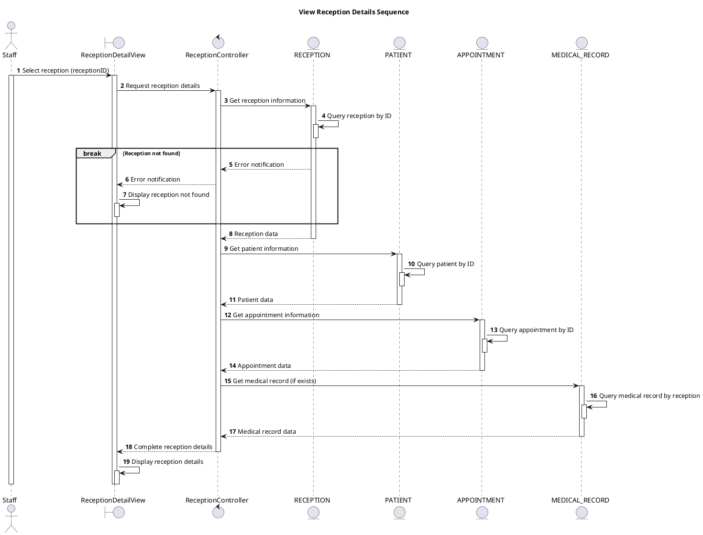

# Sequence View Reception Details

## Description

This sequence diagram describes viewing detailed information of a reception.

## Diagram

<!-- diagram id="sequence-manage-reception-view-details" -->

