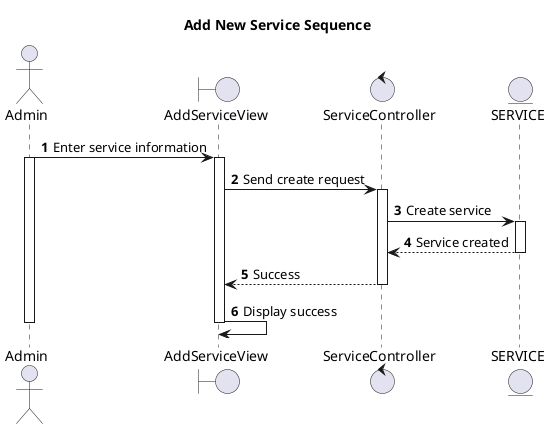

# Sequence Add New Service

## Description

Standard CRUD add sequence.

## Diagram

<!-- diagram id="sequence-manage-service-add-new" -->

```plantuml
@startuml
autonumber

actor Admin as A
boundary AddServiceView as ASV
control ServiceController as SC
entity SERVICE as S

title Add New Service Sequence

A -> ASV: Enter service information
activate A
activate ASV
ASV -> SC: Send create request
activate SC
SC -> S: Create service
activate S
SC <-- S: Service created
deactivate S
ASV <-- SC: Success
deactivate SC
ASV -> ASV: Display success
deactivate ASV
deactivate A

@enduml
```
