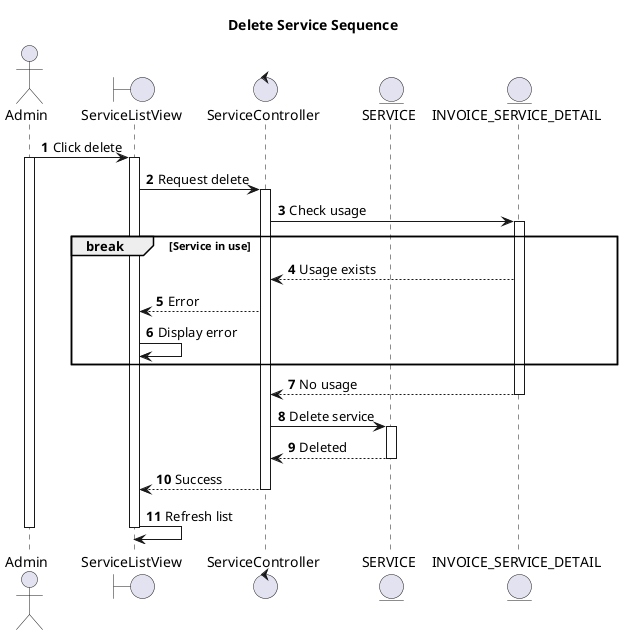

# Sequence Delete Service

## Description

Standard CRUD delete sequence with constraint check.

## Diagram

<!-- diagram id="sequence-manage-service-delete" -->

```plantuml
@startuml
autonumber

actor Admin as A
boundary ServiceListView as SLV
control ServiceController as SC
entity SERVICE as S
entity INVOICE_SERVICE_DETAIL as ISD

title Delete Service Sequence

A -> SLV: Click delete
activate A
activate SLV
SLV -> SC: Request delete
activate SC
SC -> ISD: Check usage
activate ISD
break Service in use
  SC <-- ISD: Usage exists
  SLV <-- SC: Error
  SLV -> SLV: Display error
end
SC <-- ISD: No usage
deactivate ISD
SC -> S: Delete service
activate S
SC <-- S: Deleted
deactivate S
SLV <-- SC: Success
deactivate SC
SLV -> SLV: Refresh list
deactivate SLV
deactivate A

@enduml
```
