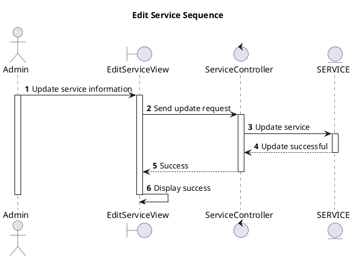

# Sequence Edit Service

## Description

Standard CRUD edit sequence.

## Diagram

<!-- diagram id="sequence-manage-service-edit" -->

```plantuml
@startuml
autonumber

actor Admin as A
boundary EditServiceView as ESV
control ServiceController as SC
entity SERVICE as S

title Edit Service Sequence

A -> ESV: Update service information
activate A
activate ESV
ESV -> SC: Send update request
activate SC
SC -> S: Update service
activate S
SC <-- S: Update successful
deactivate S
ESV <-- SC: Success
deactivate SC
ESV -> ESV: Display success
deactivate ESV
deactivate A

@enduml
```
