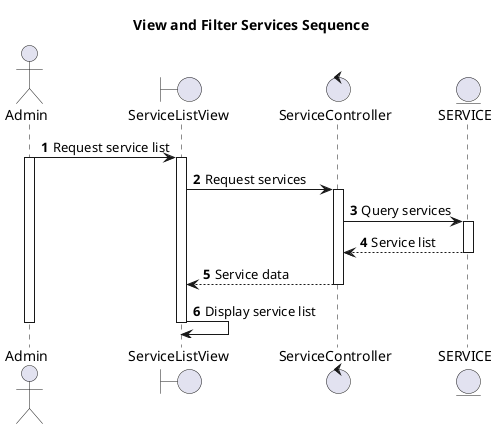

# Sequence View and Filter Services

## Description

Standard CRUD view list sequence.

## Diagram

<!-- diagram id="sequence-manage-service-view-list" -->

```plantuml
@startuml
autonumber

actor Admin as A
boundary ServiceListView as SLV
control ServiceController as SC
entity SERVICE as S

title View and Filter Services Sequence

A -> SLV: Request service list
activate A
activate SLV
SLV -> SC: Request services
activate SC
SC -> S: Query services
activate S
SC <-- S: Service list
deactivate S
SLV <-- SC: Service data
deactivate SC
SLV -> SLV: Display service list
deactivate SLV
deactivate A

@enduml
```
