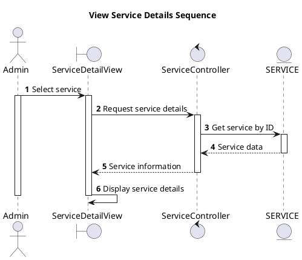

# Sequence View Service Details

## Description

Standard CRUD view details sequence.

## Diagram

<!-- diagram id="sequence-manage-service-view-details" -->

```plantuml
@startuml
autonumber

actor Admin as A
boundary ServiceDetailView as SDV
control ServiceController as SC
entity SERVICE as S

title View Service Details Sequence

A -> SDV: Select service
activate A
activate SDV
SDV -> SC: Request service details
activate SC
SC -> S: Get service by ID
activate S
SC <-- S: Service data
deactivate S
SDV <-- SC: Service information
deactivate SC
SDV -> SDV: Display service details
deactivate SDV
deactivate A

@enduml
```
