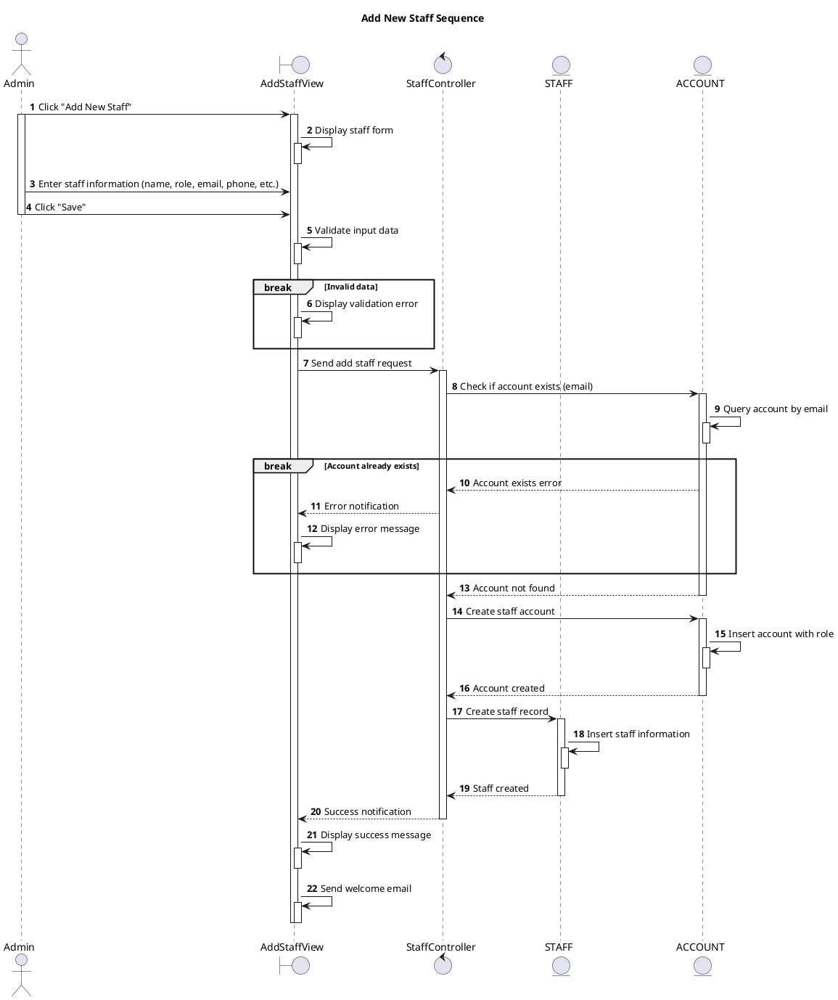

# Sequence Add New Staff

## Description

This sequence diagram describes adding a new staff member.

## Diagram

<!-- diagram id="sequence-manage-staff-add-new" -->

```plantuml
@startuml
autonumber

actor Admin as A
boundary AddStaffView as ASV
control StaffController as SC
entity STAFF as S
entity ACCOUNT as AC

title Add New Staff Sequence

A -> ASV: Click "Add New Staff"
activate A
activate ASV

ASV -> ASV: Display staff form
activate ASV
deactivate ASV

A -> ASV: Enter staff information (name, role, email, phone, etc.)
A -> ASV: Click "Save"
deactivate A

ASV -> ASV: Validate input data
activate ASV
deactivate ASV

break Invalid data
  ASV -> ASV: Display validation error
  activate ASV
  deactivate ASV
end

ASV -> SC: Send add staff request
activate SC

SC -> AC: Check if account exists (email)
activate AC
AC -> AC: Query account by email
activate AC
deactivate AC

break Account already exists
  SC <-- AC: Account exists error
  ASV <-- SC: Error notification
  ASV -> ASV: Display error message
  activate ASV
  deactivate ASV
end

SC <-- AC: Account not found
deactivate AC

SC -> AC: Create staff account
activate AC
AC -> AC: Insert account with role
activate AC
deactivate AC
SC <-- AC: Account created
deactivate AC

SC -> S: Create staff record
activate S
S -> S: Insert staff information
activate S
deactivate S
SC <-- S: Staff created
deactivate S

ASV <-- SC: Success notification
deactivate SC
ASV -> ASV: Display success message
activate ASV
deactivate ASV
ASV -> ASV: Send welcome email
activate ASV
deactivate ASV

deactivate ASV

@enduml
```
