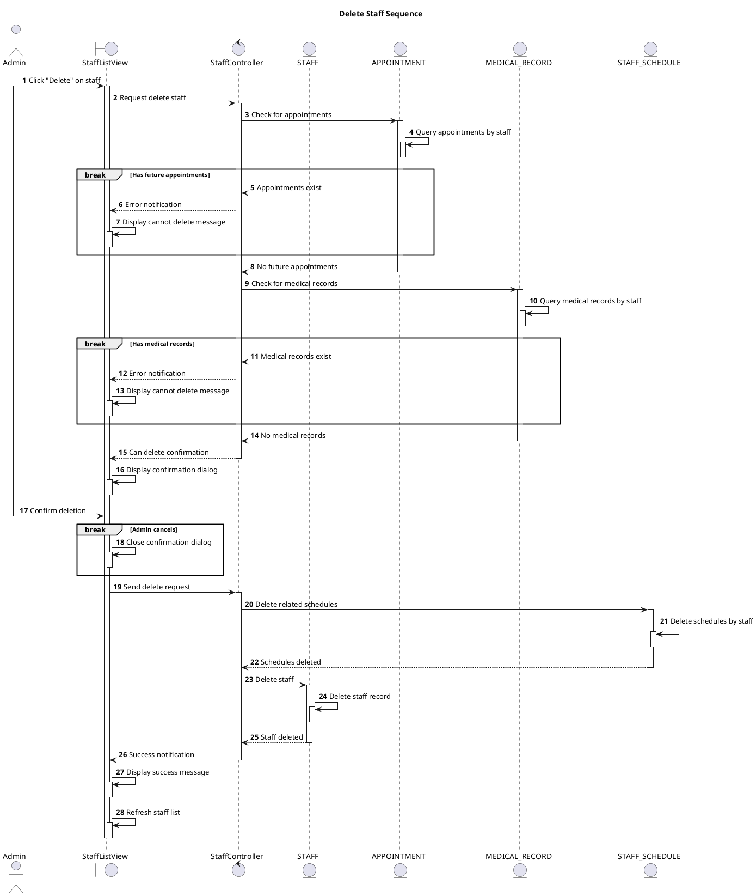

# Sequence Delete Staff

## Description

This sequence diagram describes deleting a staff member.

## Diagram

<!-- diagram id="sequence-manage-staff-delete" -->

```plantuml
@startuml
autonumber

actor Admin as A
boundary StaffListView as SLV
control StaffController as SC
entity STAFF as S
entity APPOINTMENT as AP
entity MEDICAL_RECORD as MR
entity STAFF_SCHEDULE as SS

title Delete Staff Sequence

A -> SLV: Click "Delete" on staff
activate A
activate SLV

SLV -> SC: Request delete staff
activate SC

SC -> AP: Check for appointments
activate AP
AP -> AP: Query appointments by staff
activate AP
deactivate AP

break Has future appointments
  SC <-- AP: Appointments exist
  SLV <-- SC: Error notification
  SLV -> SLV: Display cannot delete message
  activate SLV
  deactivate SLV
end

SC <-- AP: No future appointments
deactivate AP

SC -> MR: Check for medical records
activate MR
MR -> MR: Query medical records by staff
activate MR
deactivate MR

break Has medical records
  SC <-- MR: Medical records exist
  SLV <-- SC: Error notification
  SLV -> SLV: Display cannot delete message
  activate SLV
  deactivate SLV
end

SC <-- MR: No medical records
deactivate MR

SLV <-- SC: Can delete confirmation
deactivate SC
SLV -> SLV: Display confirmation dialog
activate SLV
deactivate SLV

A -> SLV: Confirm deletion
deactivate A

break Admin cancels
  SLV -> SLV: Close confirmation dialog
  activate SLV
  deactivate SLV
end

SLV -> SC: Send delete request
activate SC

SC -> SS: Delete related schedules
activate SS
SS -> SS: Delete schedules by staff
activate SS
deactivate SS
SC <-- SS: Schedules deleted
deactivate SS

SC -> S: Delete staff
activate S
S -> S: Delete staff record
activate S
deactivate S
SC <-- S: Staff deleted
deactivate S

SLV <-- SC: Success notification
deactivate SC
SLV -> SLV: Display success message
activate SLV
deactivate SLV
SLV -> SLV: Refresh staff list
activate SLV
deactivate SLV

deactivate SLV

@enduml
```
