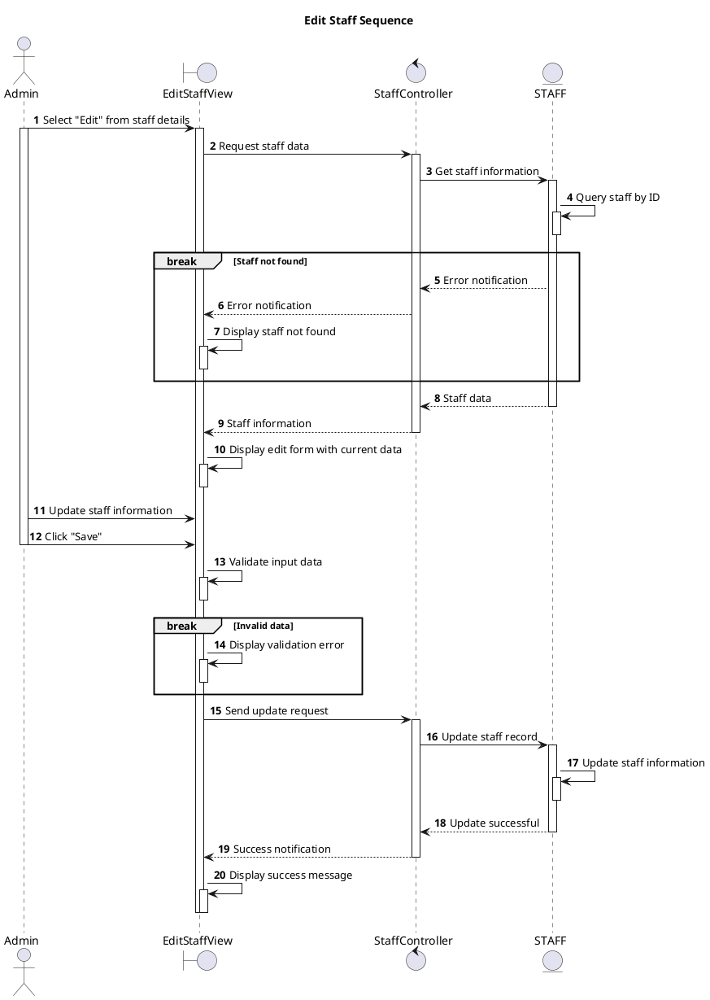

# Sequence Edit Staff

## Description

This sequence diagram describes editing staff information.

## Diagram

<!-- diagram id="sequence-manage-staff-edit" -->

```plantuml
@startuml
autonumber

actor Admin as A
boundary EditStaffView as ESV
control StaffController as SC
entity STAFF as S

title Edit Staff Sequence

A -> ESV: Select "Edit" from staff details
activate A
activate ESV

ESV -> SC: Request staff data
activate SC

SC -> S: Get staff information
activate S
S -> S: Query staff by ID
activate S
deactivate S

break Staff not found
  SC <-- S: Error notification
  ESV <-- SC: Error notification
  ESV -> ESV: Display staff not found
  activate ESV
  deactivate ESV
end

SC <-- S: Staff data
deactivate S

ESV <-- SC: Staff information
deactivate SC
ESV -> ESV: Display edit form with current data
activate ESV
deactivate ESV

A -> ESV: Update staff information
A -> ESV: Click "Save"
deactivate A

ESV -> ESV: Validate input data
activate ESV
deactivate ESV

break Invalid data
  ESV -> ESV: Display validation error
  activate ESV
  deactivate ESV
end

ESV -> SC: Send update request
activate SC

SC -> S: Update staff record
activate S
S -> S: Update staff information
activate S
deactivate S
SC <-- S: Update successful
deactivate S

ESV <-- SC: Success notification
deactivate SC
ESV -> ESV: Display success message
activate ESV
deactivate ESV

deactivate ESV

@enduml
```
