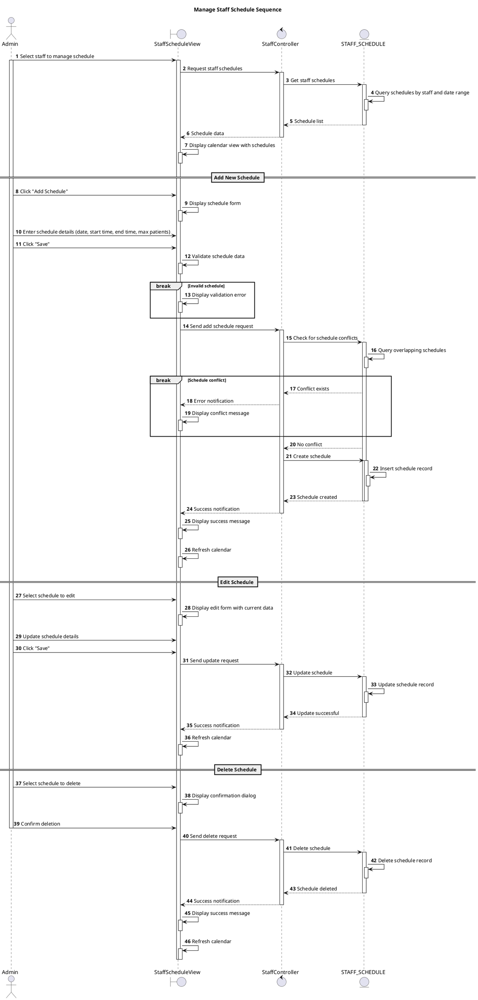

# Sequence Manage Staff Schedule

## Description

This sequence diagram describes managing staff work schedules.

## Diagram

<!-- diagram id="sequence-manage-staff-manage-schedule" -->

```plantuml
@startuml
autonumber

actor Admin as A
boundary StaffScheduleView as SSV
control StaffController as SC
entity STAFF_SCHEDULE as SS

title Manage Staff Schedule Sequence

A -> SSV: Select staff to manage schedule
activate A
activate SSV

SSV -> SC: Request staff schedules
activate SC

SC -> SS: Get staff schedules
activate SS
SS -> SS: Query schedules by staff and date range
activate SS
deactivate SS
SC <-- SS: Schedule list
deactivate SS

SSV <-- SC: Schedule data
deactivate SC
SSV -> SSV: Display calendar view with schedules
activate SSV
deactivate SSV

== Add New Schedule ==

A -> SSV: Click "Add Schedule"
SSV -> SSV: Display schedule form
activate SSV
deactivate SSV

A -> SSV: Enter schedule details (date, start time, end time, max patients)
A -> SSV: Click "Save"

SSV -> SSV: Validate schedule data
activate SSV
deactivate SSV

break Invalid schedule
  SSV -> SSV: Display validation error
  activate SSV
  deactivate SSV
end

SSV -> SC: Send add schedule request
activate SC

SC -> SS: Check for schedule conflicts
activate SS
SS -> SS: Query overlapping schedules
activate SS
deactivate SS

break Schedule conflict
  SC <-- SS: Conflict exists
  SSV <-- SC: Error notification
  SSV -> SSV: Display conflict message
  activate SSV
  deactivate SSV
end

SC <-- SS: No conflict

SC -> SS: Create schedule
activate SS
SS -> SS: Insert schedule record
activate SS
deactivate SS
SC <-- SS: Schedule created
deactivate SS
deactivate SS

SSV <-- SC: Success notification
deactivate SC
SSV -> SSV: Display success message
activate SSV
deactivate SSV
SSV -> SSV: Refresh calendar
activate SSV
deactivate SSV

== Edit Schedule ==

A -> SSV: Select schedule to edit
SSV -> SSV: Display edit form with current data
activate SSV
deactivate SSV

A -> SSV: Update schedule details
A -> SSV: Click "Save"

SSV -> SC: Send update request
activate SC

SC -> SS: Update schedule
activate SS
SS -> SS: Update schedule record
activate SS
deactivate SS
SC <-- SS: Update successful
deactivate SS

SSV <-- SC: Success notification
deactivate SC
SSV -> SSV: Refresh calendar
activate SSV
deactivate SSV

== Delete Schedule ==

A -> SSV: Select schedule to delete
SSV -> SSV: Display confirmation dialog
activate SSV
deactivate SSV

A -> SSV: Confirm deletion
deactivate A

SSV -> SC: Send delete request
activate SC

SC -> SS: Delete schedule
activate SS
SS -> SS: Delete schedule record
activate SS
deactivate SS
SC <-- SS: Schedule deleted
deactivate SS

SSV <-- SC: Success notification
deactivate SC
SSV -> SSV: Display success message
activate SSV
deactivate SSV
SSV -> SSV: Refresh calendar
activate SSV
deactivate SSV

deactivate SSV

@enduml
```
