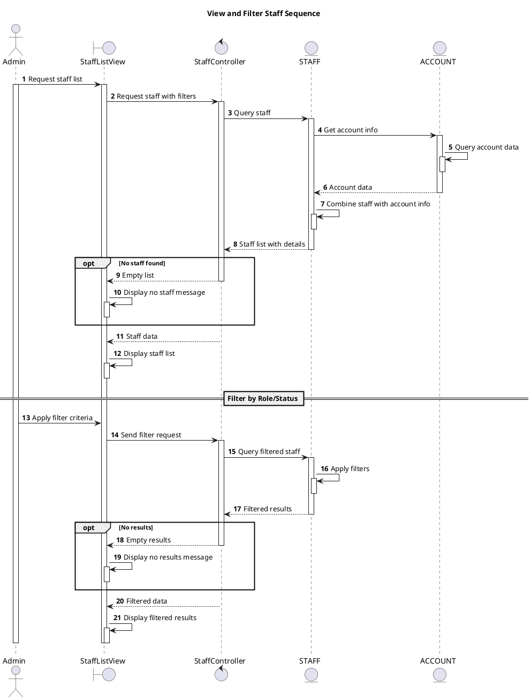

# Sequence View and Filter Staff

## Description

This sequence diagram describes viewing and filtering staff members.

## Diagram

<!-- diagram id="sequence-manage-staff-view-and-filter" -->

```plantuml
@startuml
autonumber

actor Admin as A
boundary StaffListView as SLV
control StaffController as SC
entity STAFF as S
entity ACCOUNT as AC

title View and Filter Staff Sequence

A -> SLV: Request staff list
activate A
activate SLV

SLV -> SC: Request staff with filters
activate SC

SC -> S: Query staff
activate S

S -> AC: Get account info
activate AC
AC -> AC: Query account data
activate AC
deactivate AC
S <-- AC: Account data
deactivate AC

S -> S: Combine staff with account info
activate S
deactivate S

SC <-- S: Staff list with details
deactivate S

opt No staff found
  SLV <-- SC: Empty list
  deactivate SC
  SLV -> SLV: Display no staff message
  activate SLV
  deactivate SLV
end

SLV <-- SC: Staff data
deactivate SC
SLV -> SLV: Display staff list
activate SLV
deactivate SLV

== Filter by Role/Status ==

A -> SLV: Apply filter criteria
SLV -> SC: Send filter request
activate SC

SC -> S: Query filtered staff
activate S
S -> S: Apply filters
activate S
deactivate S
SC <-- S: Filtered results
deactivate S

opt No results
  SLV <-- SC: Empty results
  deactivate SC
  SLV -> SLV: Display no results message
  activate SLV
  deactivate SLV
end

SLV <-- SC: Filtered data
deactivate SC
SLV -> SLV: Display filtered results
activate SLV
deactivate SLV

deactivate SLV
deactivate A

@enduml
```
