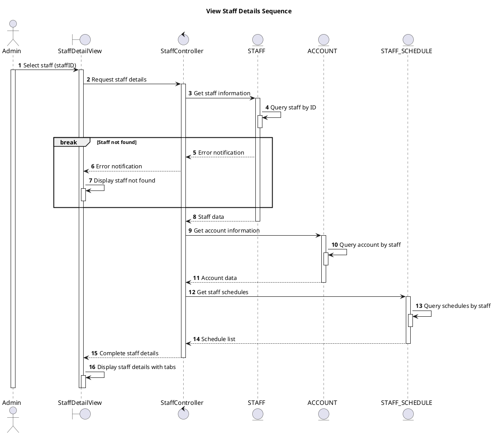

# Sequence View Staff Details

## Description

This sequence diagram describes viewing detailed information of a staff member.

## Diagram

<!-- diagram id="sequence-manage-staff-view-details" -->

