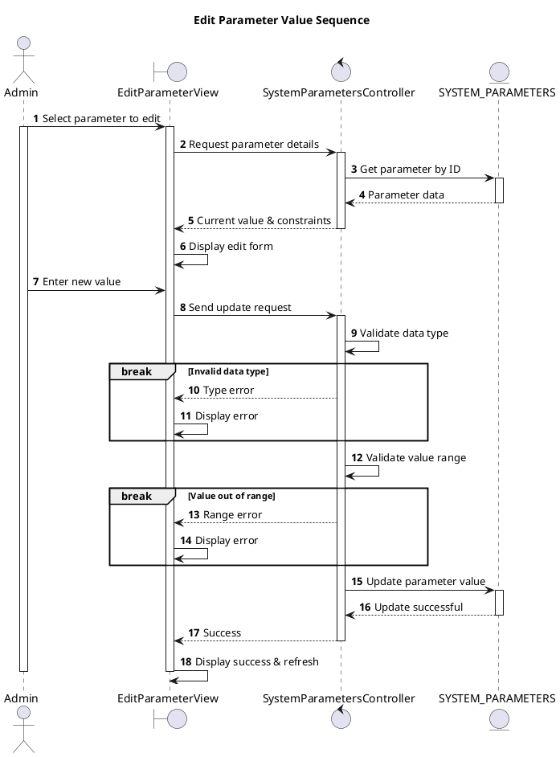

# Sequence Edit Parameter Value

## Description

Admin chỉnh sửa giá trị tham số hệ thống với validation.

## Diagram

<!-- diagram id="sequence-system-parameters-edit" -->

```plantuml
@startuml
autonumber

actor Admin as A
boundary EditParameterView as EPV
control SystemParametersController as SPC
entity SYSTEM_PARAMETERS as SP

title Edit Parameter Value Sequence

A -> EPV: Select parameter to edit
activate A
activate EPV
EPV -> SPC: Request parameter details
activate SPC
SPC -> SP: Get parameter by ID
activate SP
SPC <-- SP: Parameter data
deactivate SP
EPV <-- SPC: Current value & constraints
deactivate SPC
EPV -> EPV: Display edit form

A -> EPV: Enter new value
EPV -> SPC: Send update request
activate SPC
SPC -> SPC: Validate data type
break Invalid data type
  EPV <-- SPC: Type error
  EPV -> EPV: Display error
end
SPC -> SPC: Validate value range
break Value out of range
  EPV <-- SPC: Range error
  EPV -> EPV: Display error
end
SPC -> SP: Update parameter value
activate SP
SPC <-- SP: Update successful
deactivate SP
EPV <-- SPC: Success
deactivate SPC
EPV -> EPV: Display success & refresh
deactivate EPV
deactivate A

@enduml
```
