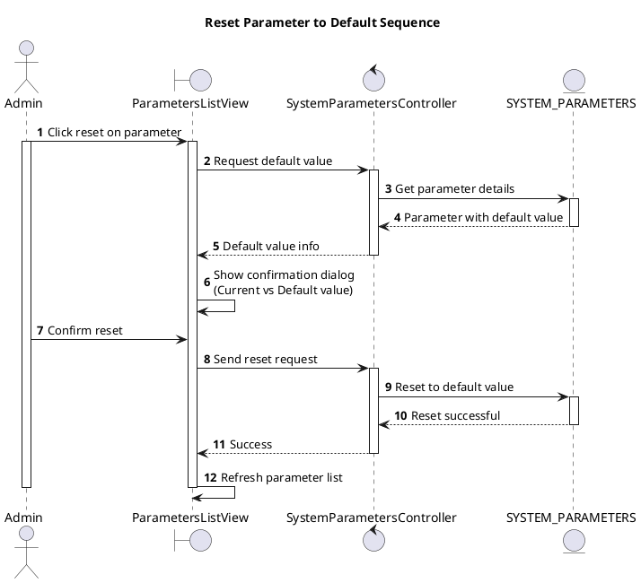

# Sequence Reset Parameter to Default

## Description

Admin khôi phục giá trị mặc định cho tham số hệ thống.

## Diagram

<!-- diagram id="sequence-system-parameters-reset" -->

```plantuml
@startuml
autonumber

actor Admin as A
boundary ParametersListView as PLV
control SystemParametersController as SPC
entity SYSTEM_PARAMETERS as SP

title Reset Parameter to Default Sequence

A -> PLV: Click reset on parameter
activate A
activate PLV
PLV -> SPC: Request default value
activate SPC
SPC -> SP: Get parameter details
activate SP
SPC <-- SP: Parameter with default value
deactivate SP
PLV <-- SPC: Default value info
deactivate SPC
PLV -> PLV: Show confirmation dialog\n(Current vs Default value)

A -> PLV: Confirm reset
PLV -> SPC: Send reset request
activate SPC
SPC -> SP: Reset to default value
activate SP
SPC <-- SP: Reset successful
deactivate SP
PLV <-- SPC: Success
deactivate SPC
PLV -> PLV: Refresh parameter list
deactivate PLV
deactivate A

@enduml
```
