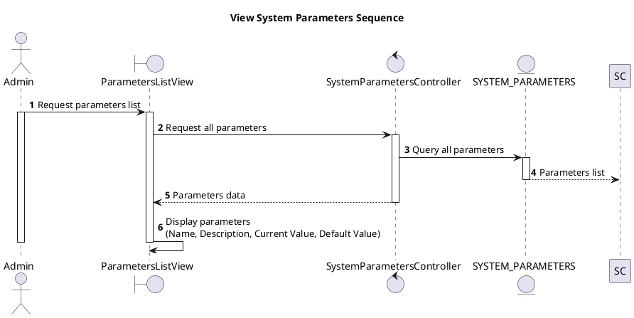

# Sequence View Parameters

## Description

Admin xem danh sách toàn bộ tham số hệ thống.

## Diagram

<!-- diagram id="sequence-system-parameters-view-list" -->

```plantuml
@startuml
autonumber

actor Admin as A
boundary ParametersListView as PLV
control SystemParametersController as SPC
entity SYSTEM_PARAMETERS as SP

title View System Parameters Sequence

A -> PLV: Request parameters list
activate A
activate PLV
PLV -> SPC: Request all parameters
activate SPC
SPC -> SP: Query all parameters
activate SP
SC <-- SP: Parameters list
deactivate SP
PLV <-- SPC: Parameters data
deactivate SPC
PLV -> PLV: Display parameters\n(Name, Description, Current Value, Default Value)
deactivate PLV
deactivate A

@enduml
```
