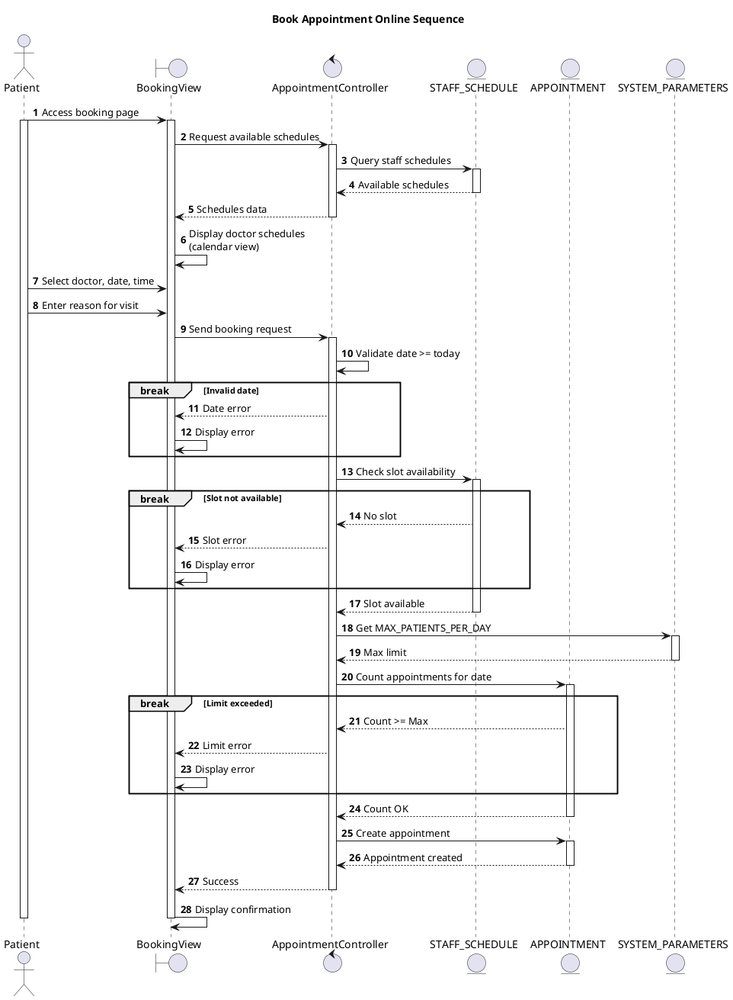

# Sequence Book Appointment Online

## Description

Bệnh nhân tự đặt lịch hẹn khám qua portal với kiểm tra slot và giới hạn.

## Diagram

<!-- diagram id="sequence-patient-portal-book-appointment" -->

