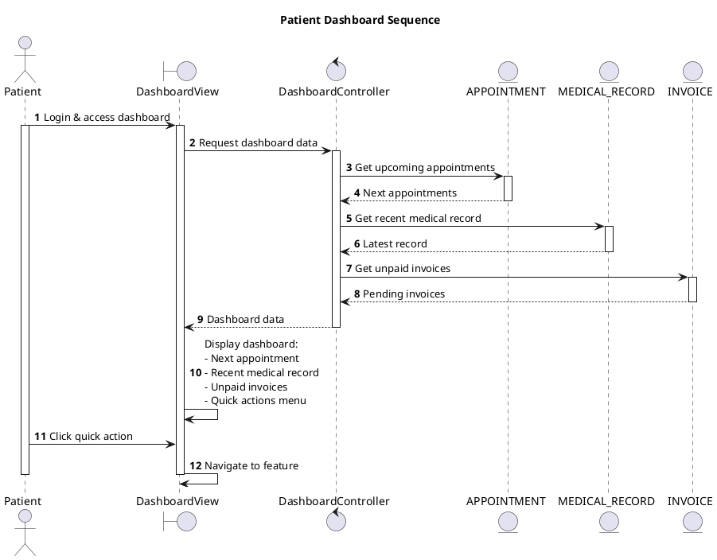

# Sequence Patient Dashboard

## Description

Trang chủ bệnh nhân hiển thị tổng quan và quick actions.

## Diagram

<!-- diagram id="sequence-patient-portal-dashboard" -->

```plantuml
@startuml
autonumber

actor Patient as P
boundary DashboardView as DV
control DashboardController as DC
entity APPOINTMENT as AP
entity MEDICAL_RECORD as MR
entity INVOICE as INV

title Patient Dashboard Sequence

P -> DV: Login & access dashboard
activate P
activate DV
DV -> DC: Request dashboard data
activate DC

DC -> AP: Get upcoming appointments
activate AP
DC <-- AP: Next appointments
deactivate AP

DC -> MR: Get recent medical record
activate MR
DC <-- MR: Latest record
deactivate MR

DC -> INV: Get unpaid invoices
activate INV
DC <-- INV: Pending invoices
deactivate INV

DV <-- DC: Dashboard data
deactivate DC

DV -> DV: Display dashboard:\n- Next appointment\n- Recent medical record\n- Unpaid invoices\n- Quick actions menu

P -> DV: Click quick action
DV -> DV: Navigate to feature
deactivate DV
deactivate P

@enduml
```
