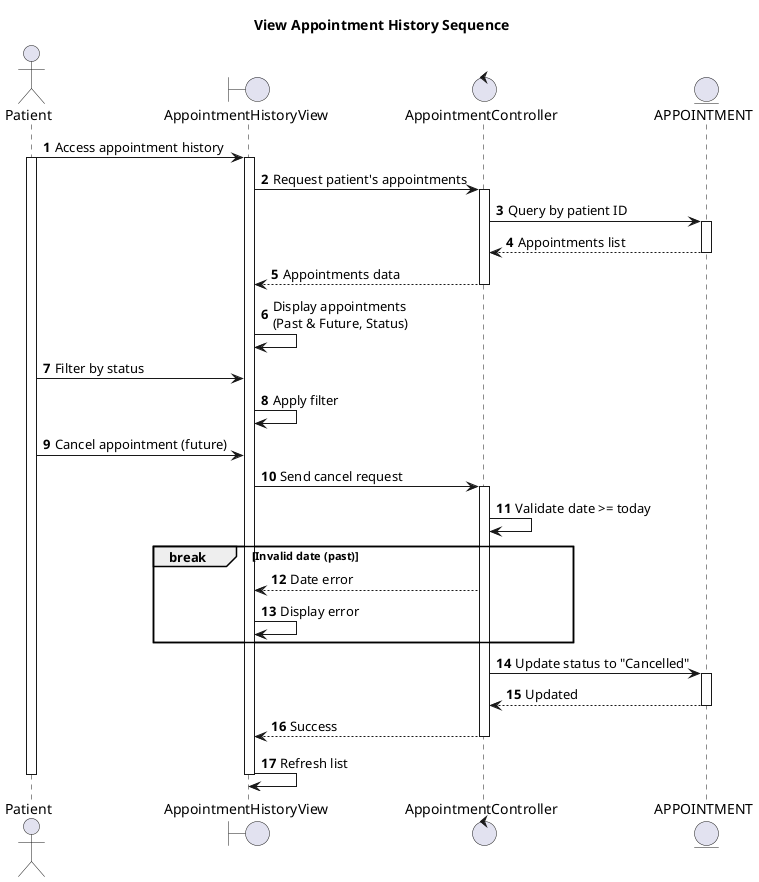

# Sequence View Appointment History

## Description

Bệnh nhân xem lịch sử đặt hẹn với khả năng hủy.

## Diagram

<!-- diagram id="sequence-patient-portal-view-appointments" -->

```plantuml
@startuml
autonumber

actor Patient as P
boundary AppointmentHistoryView as AHV
control AppointmentController as AC
entity APPOINTMENT as AP

title View Appointment History Sequence

P -> AHV: Access appointment history
activate P
activate AHV
AHV -> AC: Request patient's appointments
activate AC
AC -> AP: Query by patient ID
activate AP
AC <-- AP: Appointments list
deactivate AP
AHV <-- AC: Appointments data
deactivate AC
AHV -> AHV: Display appointments\n(Past & Future, Status)

P -> AHV: Filter by status
AHV -> AHV: Apply filter

P -> AHV: Cancel appointment (future)
AHV -> AC: Send cancel request
activate AC
AC -> AC: Validate date >= today
break Invalid date (past)
  AHV <-- AC: Date error
  AHV -> AHV: Display error
end

AC -> AP: Update status to "Cancelled"
activate AP
AC <-- AP: Updated
deactivate AP
AHV <-- AC: Success
deactivate AC
AHV -> AHV: Refresh list
deactivate AHV
deactivate P

@enduml
```
