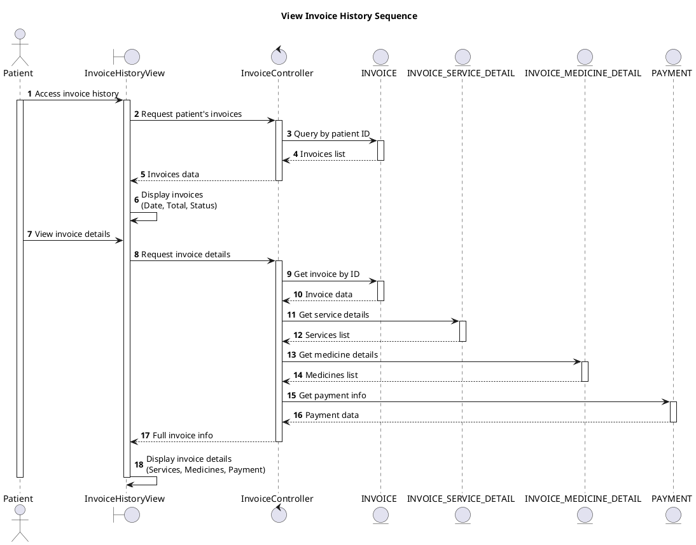

# Sequence View Invoice History

## Description

Bệnh nhân xem lịch sử hóa đơn và chi tiết thanh toán.

## Diagram

<!-- diagram id="sequence-patient-portal-view-invoices" -->

```plantuml
@startuml
autonumber

actor Patient as P
boundary InvoiceHistoryView as IHV
control InvoiceController as IC
entity INVOICE as INV
entity INVOICE_SERVICE_DETAIL as ISD
entity INVOICE_MEDICINE_DETAIL as IMD
entity PAYMENT as PAY

title View Invoice History Sequence

P -> IHV: Access invoice history
activate P
activate IHV
IHV -> IC: Request patient's invoices
activate IC
IC -> INV: Query by patient ID
activate INV
IC <-- INV: Invoices list
deactivate INV
IHV <-- IC: Invoices data
deactivate IC
IHV -> IHV: Display invoices\n(Date, Total, Status)

P -> IHV: View invoice details
IHV -> IC: Request invoice details
activate IC
IC -> INV: Get invoice by ID
activate INV
IC <-- INV: Invoice data
deactivate INV
IC -> ISD: Get service details
activate ISD
IC <-- ISD: Services list
deactivate ISD
IC -> IMD: Get medicine details
activate IMD
IC <-- IMD: Medicines list
deactivate IMD
IC -> PAY: Get payment info
activate PAY
IC <-- PAY: Payment data
deactivate PAY
IHV <-- IC: Full invoice info
deactivate IC
IHV -> IHV: Display invoice details\n(Services, Medicines, Payment)
deactivate IHV
deactivate P

@enduml
```
