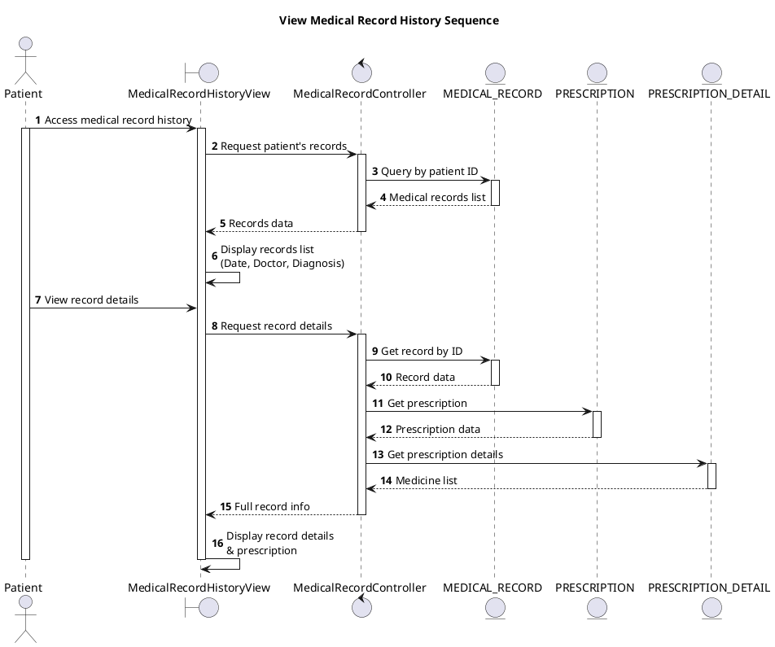

# Sequence View Medical Record History

## Description

Bệnh nhân xem lịch sử hồ sơ khám bệnh của mình.

## Diagram

<!-- diagram id="sequence-patient-portal-view-records" -->

```plantuml
@startuml
autonumber

actor Patient as P
boundary MedicalRecordHistoryView as MRHV
control MedicalRecordController as MRC
entity MEDICAL_RECORD as MR
entity PRESCRIPTION as PR
entity PRESCRIPTION_DETAIL as PD

title View Medical Record History Sequence

P -> MRHV: Access medical record history
activate P
activate MRHV
MRHV -> MRC: Request patient's records
activate MRC
MRC -> MR: Query by patient ID
activate MR
MRC <-- MR: Medical records list
deactivate MR
MRHV <-- MRC: Records data
deactivate MRC
MRHV -> MRHV: Display records list\n(Date, Doctor, Diagnosis)

P -> MRHV: View record details
MRHV -> MRC: Request record details
activate MRC
MRC -> MR: Get record by ID
activate MR
MRC <-- MR: Record data
deactivate MR
MRC -> PR: Get prescription
activate PR
MRC <-- PR: Prescription data
deactivate PR
MRC -> PD: Get prescription details
activate PD
MRC <-- PD: Medicine list
deactivate PD
MRHV <-- MRC: Full record info
deactivate MRC
MRHV -> MRHV: Display record details\n& prescription
deactivate MRHV
deactivate P

@enduml
```
