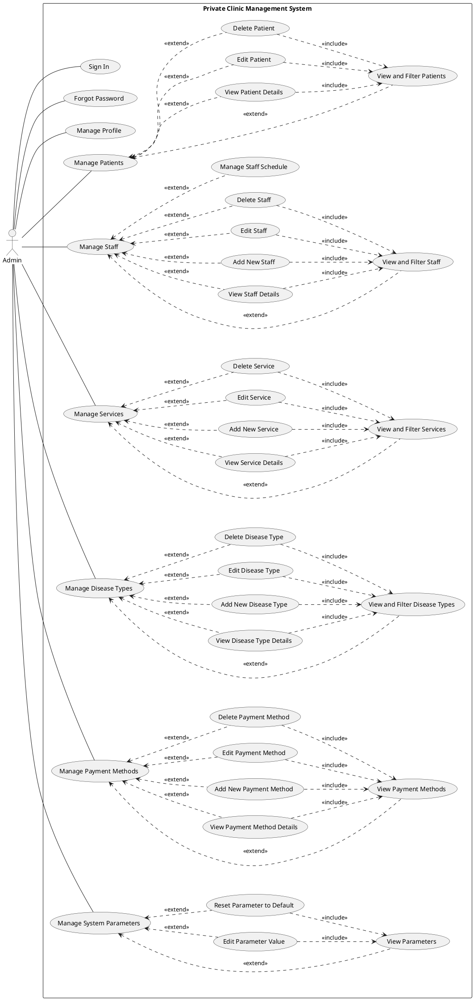

### 6.1.1. Use Case Diagram - Admin

```plantuml
@startuml
left to right direction
actor Admin

rectangle "Private Clinic Management System" {

  ' Authentication
  usecase UC_AUTH_01 as "Sign In"
  usecase UC_AUTH_03 as "Forgot Password"
  usecase UC_AUTH_04 as "Manage Profile"

  ' Patient Management
  usecase UC_PAT as "Manage Patients"
  usecase UC_PAT_01 as "View and Filter Patients"
  usecase UC_PAT_02 as "View Patient Details"
  usecase UC_PAT_04 as "Edit Patient"
  usecase UC_PAT_05 as "Delete Patient"

  ' Staff Management
  usecase UC_STF as "Manage Staff"
  usecase UC_STF_01 as "View and Filter Staff"
  usecase UC_STF_02 as "View Staff Details"
  usecase UC_STF_03 as "Add New Staff"
  usecase UC_STF_04 as "Edit Staff"
  usecase UC_STF_05 as "Delete Staff"
  usecase UC_STF_06 as "Manage Staff Schedule"

  ' Service Management
  usecase UC_SVC as "Manage Services"
  usecase UC_SVC_01 as "View and Filter Services"
  usecase UC_SVC_02 as "View Service Details"
  usecase UC_SVC_03 as "Add New Service"
  usecase UC_SVC_04 as "Edit Service"
  usecase UC_SVC_05 as "Delete Service"

  ' Disease Type Management
  usecase UC_DIS as "Manage Disease Types"
  usecase UC_DIS_01 as "View and Filter Disease Types"
  usecase UC_DIS_02 as "View Disease Type Details"
  usecase UC_DIS_03 as "Add New Disease Type"
  usecase UC_DIS_04 as "Edit Disease Type"
  usecase UC_DIS_05 as "Delete Disease Type"

  ' Payment Method Management
  usecase UC_PAY as "Manage Payment Methods"
  usecase UC_PAY_01 as "View Payment Methods"
  usecase UC_PAY_02 as "View Payment Method Details"
  usecase UC_PAY_03 as "Add New Payment Method"
  usecase UC_PAY_04 as "Edit Payment Method"
  usecase UC_PAY_05 as "Delete Payment Method"

  ' System Parameters Management
  usecase UC_PAR as "Manage System Parameters"
  usecase UC_PAR_01 as "View Parameters"
  usecase UC_PAR_02 as "Edit Parameter Value"
  usecase UC_PAR_03 as "Reset Parameter to Default"
}

' Admin connections
Admin -- UC_AUTH_01
Admin -- UC_AUTH_03
Admin -- UC_AUTH_04
Admin -- UC_PAT
Admin -- UC_STF
Admin -- UC_SVC
Admin -- UC_DIS
Admin -- UC_PAY
Admin -- UC_PAR

' Patient Management relationships
UC_PAT <.. UC_PAT_01 : <<extend>>
UC_PAT <.. UC_PAT_02 : <<extend>>
UC_PAT <.. UC_PAT_04 : <<extend>>
UC_PAT <.. UC_PAT_05 : <<extend>>
UC_PAT_02 ..> UC_PAT_01 : <<include>>
UC_PAT_04 ..> UC_PAT_01 : <<include>>
UC_PAT_05 ..> UC_PAT_01 : <<include>>

' Staff Management relationships
UC_STF <.. UC_STF_01 : <<extend>>
UC_STF <.. UC_STF_02 : <<extend>>
UC_STF <.. UC_STF_03 : <<extend>>
UC_STF <.. UC_STF_04 : <<extend>>
UC_STF <.. UC_STF_05 : <<extend>>
UC_STF <.. UC_STF_06 : <<extend>>
UC_STF_02 ..> UC_STF_01 : <<include>>
UC_STF_03 ..> UC_STF_01 : <<include>>
UC_STF_04 ..> UC_STF_01 : <<include>>
UC_STF_05 ..> UC_STF_01 : <<include>>

' Service Management relationships
UC_SVC <.. UC_SVC_01 : <<extend>>
UC_SVC <.. UC_SVC_02 : <<extend>>
UC_SVC <.. UC_SVC_03 : <<extend>>
UC_SVC <.. UC_SVC_04 : <<extend>>
UC_SVC <.. UC_SVC_05 : <<extend>>
UC_SVC_02 ..> UC_SVC_01 : <<include>>
UC_SVC_03 ..> UC_SVC_01 : <<include>>
UC_SVC_04 ..> UC_SVC_01 : <<include>>
UC_SVC_05 ..> UC_SVC_01 : <<include>>

' Disease Type Management relationships
UC_DIS <.. UC_DIS_01 : <<extend>>
UC_DIS <.. UC_DIS_02 : <<extend>>
UC_DIS <.. UC_DIS_03 : <<extend>>
UC_DIS <.. UC_DIS_04 : <<extend>>
UC_DIS <.. UC_DIS_05 : <<extend>>
UC_DIS_02 ..> UC_DIS_01 : <<include>>
UC_DIS_03 ..> UC_DIS_01 : <<include>>
UC_DIS_04 ..> UC_DIS_01 : <<include>>
UC_DIS_05 ..> UC_DIS_01 : <<include>>

' Payment Method Management relationships
UC_PAY <.. UC_PAY_01 : <<extend>>
UC_PAY <.. UC_PAY_02 : <<extend>>
UC_PAY <.. UC_PAY_03 : <<extend>>
UC_PAY <.. UC_PAY_04 : <<extend>>
UC_PAY <.. UC_PAY_05 : <<extend>>
UC_PAY_02 ..> UC_PAY_01 : <<include>>
UC_PAY_03 ..> UC_PAY_01 : <<include>>
UC_PAY_04 ..> UC_PAY_01 : <<include>>
UC_PAY_05 ..> UC_PAY_01 : <<include>>

' System Parameters Management relationships
UC_PAR <.. UC_PAR_01 : <<extend>>
UC_PAR <.. UC_PAR_02 : <<extend>>
UC_PAR <.. UC_PAR_03 : <<extend>>
UC_PAR_02 ..> UC_PAR_01 : <<include>>
UC_PAR_03 ..> UC_PAR_01 : <<include>>

@enduml
```
