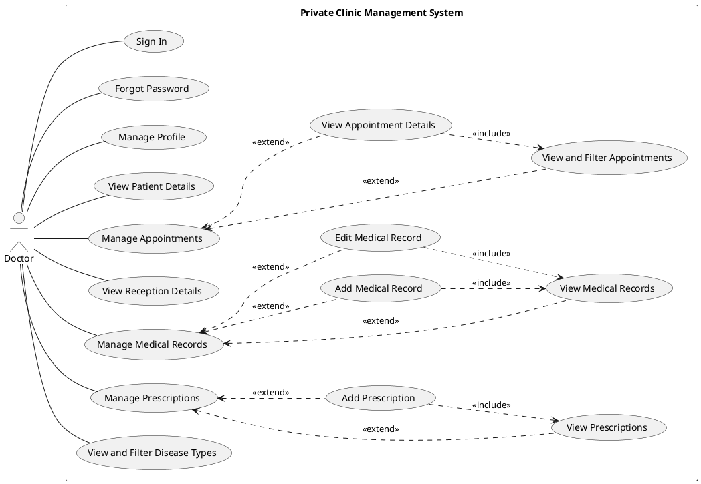

### 6.1.2. Use Case Diagram - Doctor

```plantuml
@startuml
left to right direction
actor Doctor

rectangle "Private Clinic Management System" {

  ' Authentication
  usecase UC_AUTH_01 as "Sign In"
  usecase UC_AUTH_03 as "Forgot Password"
  usecase UC_AUTH_04 as "Manage Profile"

  ' Patient Management (View only)
  usecase UC_PAT_02 as "View Patient Details"

  ' Appointment Management
  usecase UC_APT as "Manage Appointments"
  usecase UC_APT_01 as "View and Filter Appointments"
  usecase UC_APT_02 as "View Appointment Details"

  ' Reception Management (View only)
  usecase UC_RCP_02 as "View Reception Details"

  ' Medical Record Management
  usecase UC_MR as "Manage Medical Records"
  usecase UC_MR_01 as "View Medical Records"
  usecase UC_MR_02 as "Add Medical Record"
  usecase UC_MR_03 as "Edit Medical Record"

  ' Prescription Management
  usecase UC_PRESC as "Manage Prescriptions"
  usecase UC_PRESC_01 as "View Prescriptions"
  usecase UC_PRESC_02 as "Add Prescription"

  ' Disease Type (View only)
  usecase UC_DIS_01 as "View and Filter Disease Types"
}

' Doctor connections
Doctor -- UC_AUTH_01
Doctor -- UC_AUTH_03
Doctor -- UC_AUTH_04
Doctor -- UC_PAT_02
Doctor -- UC_APT
Doctor -- UC_RCP_02
Doctor -- UC_MR
Doctor -- UC_PRESC
Doctor -- UC_DIS_01

' Appointment Management relationships
UC_APT <.. UC_APT_01 : <<extend>>
UC_APT <.. UC_APT_02 : <<extend>>
UC_APT_02 ..> UC_APT_01 : <<include>>

' Medical Record Management relationships
UC_MR <.. UC_MR_01 : <<extend>>
UC_MR <.. UC_MR_02 : <<extend>>
UC_MR <.. UC_MR_03 : <<extend>>
UC_MR_02 ..> UC_MR_01 : <<include>>
UC_MR_03 ..> UC_MR_01 : <<include>>

' Prescription Management relationships
UC_PRESC <.. UC_PRESC_01 : <<extend>>
UC_PRESC <.. UC_PRESC_02 : <<extend>>
UC_PRESC_02 ..> UC_PRESC_01 : <<include>>

@enduml
```
