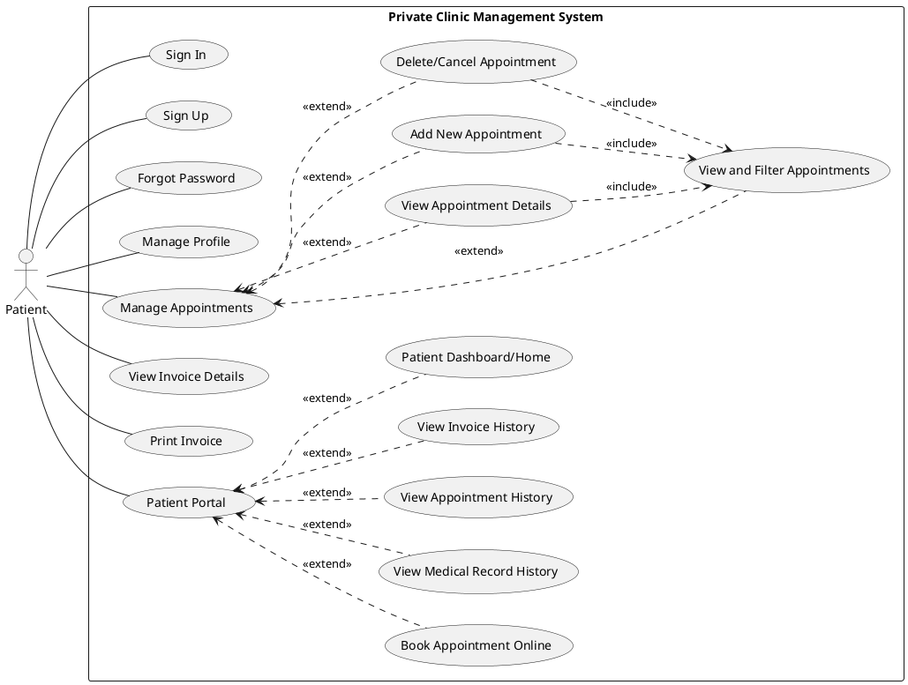

### 6.1.5. Use Case Diagram - Patient

```plantuml
@startuml
left to right direction
actor Patient

rectangle "Private Clinic Management System" {

  ' Authentication
  usecase UC_AUTH_01 as "Sign In"
  usecase UC_AUTH_02 as "Sign Up"
  usecase UC_AUTH_03 as "Forgot Password"
  usecase UC_AUTH_04 as "Manage Profile"

  ' Appointment Management
  usecase UC_APT as "Manage Appointments"
  usecase UC_APT_01 as "View and Filter Appointments"
  usecase UC_APT_02 as "View Appointment Details"
  usecase UC_APT_03 as "Add New Appointment"
  usecase UC_APT_05 as "Delete/Cancel Appointment"

  ' Invoice (View only)
  usecase UC_INV_02 as "View Invoice Details"
  usecase UC_INV_06 as "Print Invoice"

  ' Patient Portal
  usecase UC_PORTAL as "Patient Portal"
  usecase UC_PORTAL_01 as "Book Appointment Online"
  usecase UC_PORTAL_02 as "View Medical Record History"
  usecase UC_PORTAL_03 as "View Appointment History"
  usecase UC_PORTAL_04 as "View Invoice History"
  usecase UC_PORTAL_05 as "Patient Dashboard/Home"
}

' Patient connections
Patient -- UC_AUTH_01
Patient -- UC_AUTH_02
Patient -- UC_AUTH_03
Patient -- UC_AUTH_04
Patient -- UC_APT
Patient -- UC_INV_02
Patient -- UC_INV_06
Patient -- UC_PORTAL

' Appointment Management relationships
UC_APT <.. UC_APT_01 : <<extend>>
UC_APT <.. UC_APT_02 : <<extend>>
UC_APT <.. UC_APT_03 : <<extend>>
UC_APT <.. UC_APT_05 : <<extend>>
UC_APT_02 ..> UC_APT_01 : <<include>>
UC_APT_03 ..> UC_APT_01 : <<include>>
UC_APT_05 ..> UC_APT_01 : <<include>>

' Patient Portal relationships
UC_PORTAL <.. UC_PORTAL_01 : <<extend>>
UC_PORTAL <.. UC_PORTAL_02 : <<extend>>
UC_PORTAL <.. UC_PORTAL_03 : <<extend>>
UC_PORTAL <.. UC_PORTAL_04 : <<extend>>
UC_PORTAL <.. UC_PORTAL_05 : <<extend>>

@enduml
```
