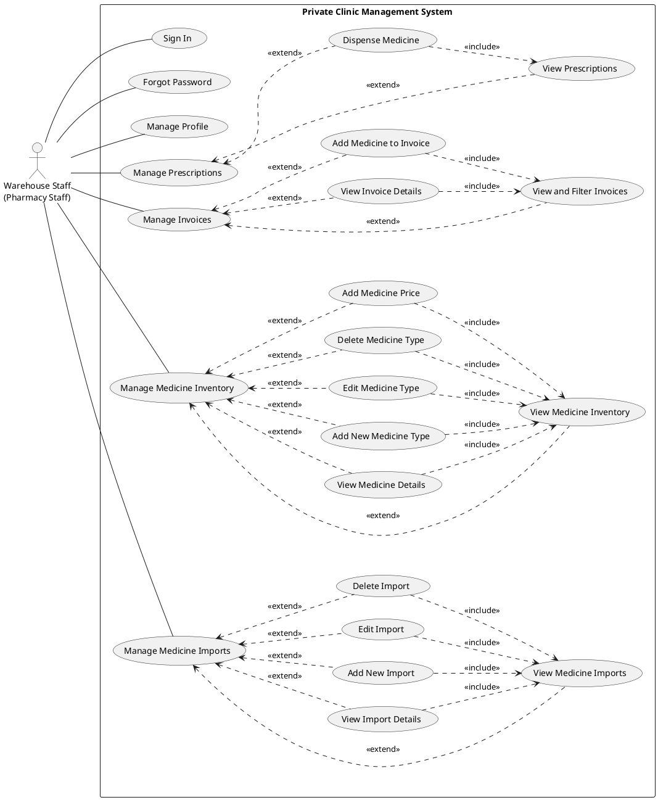

### 6.1.4. Use Case Diagram - Warehouse Staff (Pharmacy Staff)

```plantuml
@startuml
left to right direction
actor "Warehouse Staff\n(Pharmacy Staff)" as WarehouseStaff

rectangle "Private Clinic Management System" {

  ' Authentication
  usecase UC_AUTH_01 as "Sign In"
  usecase UC_AUTH_03 as "Forgot Password"
  usecase UC_AUTH_04 as "Manage Profile"

  ' Prescription Management
  usecase UC_PRESC as "Manage Prescriptions"
  usecase UC_PRESC_01 as "View Prescriptions"
  usecase UC_PRESC_03 as "Dispense Medicine"

  ' Invoice Management
  usecase UC_INV as "Manage Invoices"
  usecase UC_INV_01 as "View and Filter Invoices"
  usecase UC_INV_02 as "View Invoice Details"
  usecase UC_INV_04 as "Add Medicine to Invoice"

  ' Medicine Inventory Management
  usecase UC_MED as "Manage Medicine Inventory"
  usecase UC_MED_01 as "View Medicine Inventory"
  usecase UC_MED_02 as "View Medicine Details"
  usecase UC_MED_03 as "Add New Medicine Type"
  usecase UC_MED_04 as "Edit Medicine Type"
  usecase UC_MED_05 as "Delete Medicine Type"
  usecase UC_MED_06 as "Add Medicine Price"

  ' Medicine Import Management
  usecase UC_IMP as "Manage Medicine Imports"
  usecase UC_IMP_01 as "View Medicine Imports"
  usecase UC_IMP_02 as "View Import Details"
  usecase UC_IMP_03 as "Add New Import"
  usecase UC_IMP_04 as "Edit Import"
  usecase UC_IMP_05 as "Delete Import"
}

' Warehouse Staff connections
WarehouseStaff -- UC_AUTH_01
WarehouseStaff -- UC_AUTH_03
WarehouseStaff -- UC_AUTH_04
WarehouseStaff -- UC_PRESC
WarehouseStaff -- UC_INV
WarehouseStaff -- UC_MED
WarehouseStaff -- UC_IMP

' Prescription Management relationships
UC_PRESC <.. UC_PRESC_01 : <<extend>>
UC_PRESC <.. UC_PRESC_03 : <<extend>>
UC_PRESC_03 ..> UC_PRESC_01 : <<include>>

' Invoice Management relationships
UC_INV <.. UC_INV_01 : <<extend>>
UC_INV <.. UC_INV_02 : <<extend>>
UC_INV <.. UC_INV_04 : <<extend>>
UC_INV_02 ..> UC_INV_01 : <<include>>
UC_INV_04 ..> UC_INV_01 : <<include>>

' Medicine Inventory Management relationships
UC_MED <.. UC_MED_01 : <<extend>>
UC_MED <.. UC_MED_02 : <<extend>>
UC_MED <.. UC_MED_03 : <<extend>>
UC_MED <.. UC_MED_04 : <<extend>>
UC_MED <.. UC_MED_05 : <<extend>>
UC_MED <.. UC_MED_06 : <<extend>>
UC_MED_02 ..> UC_MED_01 : <<include>>
UC_MED_03 ..> UC_MED_01 : <<include>>
UC_MED_04 ..> UC_MED_01 : <<include>>
UC_MED_05 ..> UC_MED_01 : <<include>>
UC_MED_06 ..> UC_MED_01 : <<include>>

' Medicine Import Management relationships
UC_IMP <.. UC_IMP_01 : <<extend>>
UC_IMP <.. UC_IMP_02 : <<extend>>
UC_IMP <.. UC_IMP_03 : <<extend>>
UC_IMP <.. UC_IMP_04 : <<extend>>
UC_IMP <.. UC_IMP_05 : <<extend>>
UC_IMP_02 ..> UC_IMP_01 : <<include>>
UC_IMP_03 ..> UC_IMP_01 : <<include>>
UC_IMP_04 ..> UC_IMP_01 : <<include>>
UC_IMP_05 ..> UC_IMP_01 : <<include>>

@enduml
```
