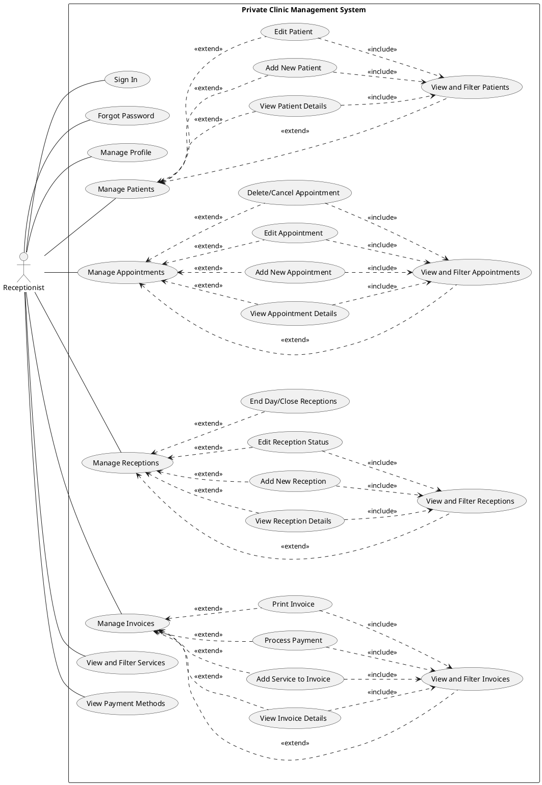

### 6.1.3. Use Case Diagram - Receptionist

```plantuml
@startuml
left to right direction
actor Receptionist

rectangle "Private Clinic Management System" {

  ' Authentication
  usecase UC_AUTH_01 as "Sign In"
  usecase UC_AUTH_03 as "Forgot Password"
  usecase UC_AUTH_04 as "Manage Profile"

  ' Patient Management
  usecase UC_PAT as "Manage Patients"
  usecase UC_PAT_01 as "View and Filter Patients"
  usecase UC_PAT_02 as "View Patient Details"
  usecase UC_PAT_03 as "Add New Patient"
  usecase UC_PAT_04 as "Edit Patient"

  ' Appointment Management
  usecase UC_APT as "Manage Appointments"
  usecase UC_APT_01 as "View and Filter Appointments"
  usecase UC_APT_02 as "View Appointment Details"
  usecase UC_APT_03 as "Add New Appointment"
  usecase UC_APT_04 as "Edit Appointment"
  usecase UC_APT_05 as "Delete/Cancel Appointment"

  ' Reception Management
  usecase UC_RCP as "Manage Receptions"
  usecase UC_RCP_01 as "View and Filter Receptions"
  usecase UC_RCP_02 as "View Reception Details"
  usecase UC_RCP_03 as "Add New Reception"
  usecase UC_RCP_04 as "Edit Reception Status"
  usecase UC_RCP_05 as "End Day/Close Receptions"

  ' Invoice Management
  usecase UC_INV as "Manage Invoices"
  usecase UC_INV_01 as "View and Filter Invoices"
  usecase UC_INV_02 as "View Invoice Details"
  usecase UC_INV_03 as "Add Service to Invoice"
  usecase UC_INV_05 as "Process Payment"
  usecase UC_INV_06 as "Print Invoice"

  ' Service & Payment Method (View only)
  usecase UC_SVC_01 as "View and Filter Services"
  usecase UC_PAY_01 as "View Payment Methods"
}

' Receptionist connections
Receptionist -- UC_AUTH_01
Receptionist -- UC_AUTH_03
Receptionist -- UC_AUTH_04
Receptionist -- UC_PAT
Receptionist -- UC_APT
Receptionist -- UC_RCP
Receptionist -- UC_INV
Receptionist -- UC_SVC_01
Receptionist -- UC_PAY_01

' Patient Management relationships
UC_PAT <.. UC_PAT_01 : <<extend>>
UC_PAT <.. UC_PAT_02 : <<extend>>
UC_PAT <.. UC_PAT_03 : <<extend>>
UC_PAT <.. UC_PAT_04 : <<extend>>
UC_PAT_02 ..> UC_PAT_01 : <<include>>
UC_PAT_03 ..> UC_PAT_01 : <<include>>
UC_PAT_04 ..> UC_PAT_01 : <<include>>

' Appointment Management relationships
UC_APT <.. UC_APT_01 : <<extend>>
UC_APT <.. UC_APT_02 : <<extend>>
UC_APT <.. UC_APT_03 : <<extend>>
UC_APT <.. UC_APT_04 : <<extend>>
UC_APT <.. UC_APT_05 : <<extend>>
UC_APT_02 ..> UC_APT_01 : <<include>>
UC_APT_03 ..> UC_APT_01 : <<include>>
UC_APT_04 ..> UC_APT_01 : <<include>>
UC_APT_05 ..> UC_APT_01 : <<include>>

' Reception Management relationships
UC_RCP <.. UC_RCP_01 : <<extend>>
UC_RCP <.. UC_RCP_02 : <<extend>>
UC_RCP <.. UC_RCP_03 : <<extend>>
UC_RCP <.. UC_RCP_04 : <<extend>>
UC_RCP <.. UC_RCP_05 : <<extend>>
UC_RCP_02 ..> UC_RCP_01 : <<include>>
UC_RCP_03 ..> UC_RCP_01 : <<include>>
UC_RCP_04 ..> UC_RCP_01 : <<include>>

' Invoice Management relationships
UC_INV <.. UC_INV_01 : <<extend>>
UC_INV <.. UC_INV_02 : <<extend>>
UC_INV <.. UC_INV_03 : <<extend>>
UC_INV <.. UC_INV_05 : <<extend>>
UC_INV <.. UC_INV_06 : <<extend>>
UC_INV_02 ..> UC_INV_01 : <<include>>
UC_INV_03 ..> UC_INV_01 : <<include>>
UC_INV_05 ..> UC_INV_01 : <<include>>
UC_INV_06 ..> UC_INV_01 : <<include>>

@enduml
```
