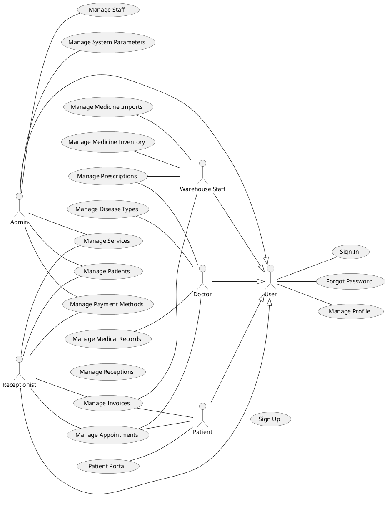

### 6.1.6. Use Case Diagram - Overview (All Actors)

```plantuml
@startuml
left to right direction

' Parent actor
actor User as User

' Child actors (left side)
actor Admin as Admin
actor Receptionist as Receptionist

' Child actors (right side)
actor Doctor as Doctor
actor "Warehouse Staff" as WarehouseStaff
actor Patient as Patient


  usecase UC_AUTH_01 as "Sign In"
  usecase UC_AUTH_02 as "Sign Up"
  usecase UC_AUTH_03 as "Forgot Password"
  usecase UC_AUTH_04 as "Manage Profile"

  usecase UC_PAT as "Manage Patients"
  usecase UC_APT as "Manage Appointments"
  usecase UC_RCP as "Manage Receptions"
  usecase UC_MR as "Manage Medical Records"
  usecase UC_PRESC as "Manage Prescriptions"
  usecase UC_INV as "Manage Invoices"
  usecase UC_STF as "Manage Staff"
  usecase UC_MED as "Manage Medicine Inventory"
  usecase UC_IMP as "Manage Medicine Imports"
  usecase UC_SVC as "Manage Services"
  usecase UC_DIS as "Manage Disease Types"
  usecase UC_PAY as "Manage Payment Methods"
  usecase UC_PAR as "Manage System Parameters"
  usecase UC_PORTAL as "Patient Portal"


' User (parent) - common authentication use cases
User -- UC_AUTH_01
User -- UC_AUTH_03
User -- UC_AUTH_04

' Generalization relationships (child actors inherit from User)
Admin --|> User
Receptionist --|> User
Doctor --|> User
WarehouseStaff --|> User
Patient --|> User

' Patient specific auth
Patient -- UC_AUTH_02

' Admin connections (left)
Admin -- UC_PAT
Admin -- UC_STF
Admin -- UC_SVC
Admin -- UC_DIS
Admin -- UC_PAY
Admin -- UC_PAR

' Doctor connections (right)
UC_APT -- Doctor
UC_MR -- Doctor
UC_PRESC -- Doctor
UC_DIS -- Doctor

' Receptionist connections (left)
Receptionist -- UC_PAT
Receptionist -- UC_APT
Receptionist -- UC_RCP
Receptionist -- UC_INV
Receptionist -- UC_SVC
Receptionist -- UC_PAY

' Warehouse Staff connections (right)
UC_PRESC -- WarehouseStaff
UC_INV -- WarehouseStaff
UC_MED -- WarehouseStaff
UC_IMP -- WarehouseStaff

' Patient connections (right)
UC_APT -- Patient
UC_INV -- Patient
UC_PORTAL -- Patient

@enduml
```
